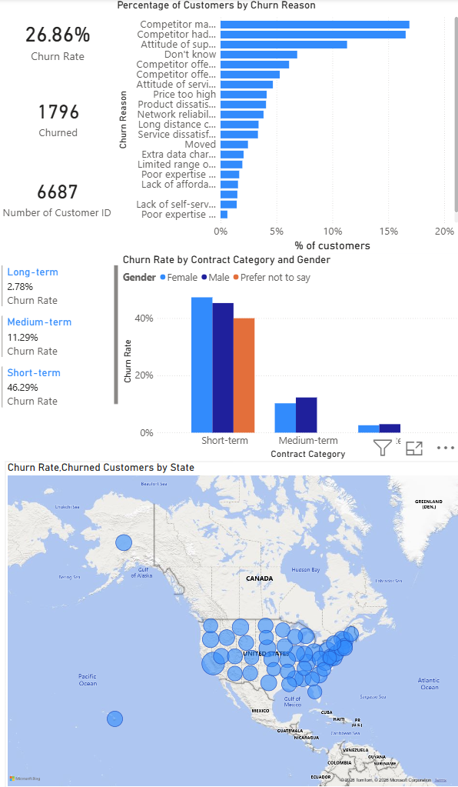
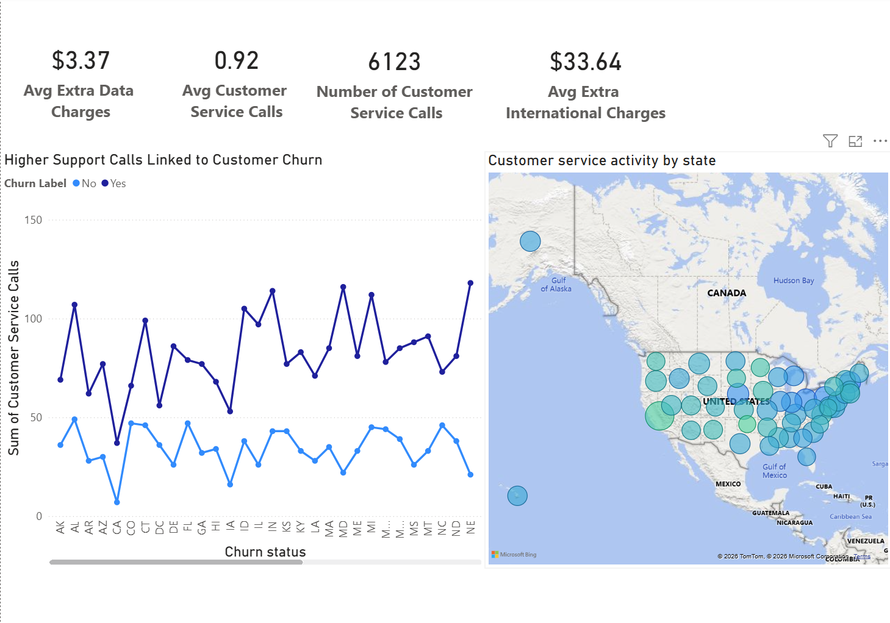
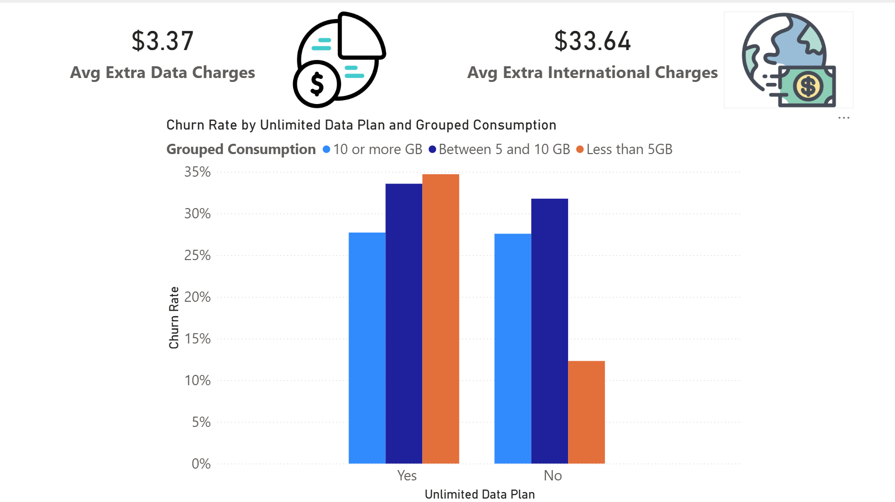
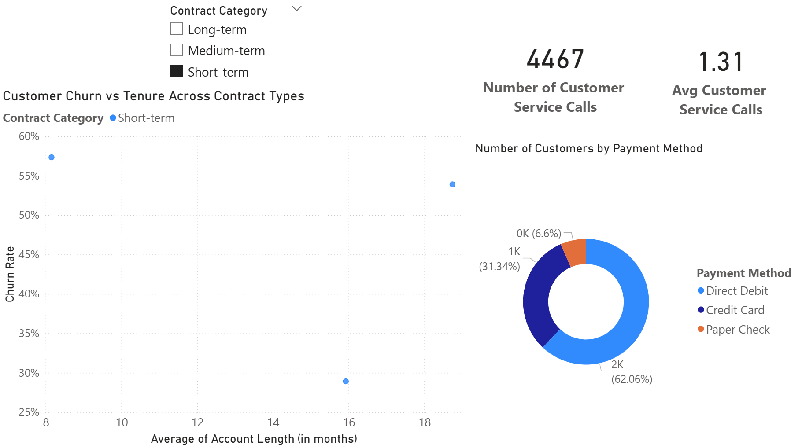
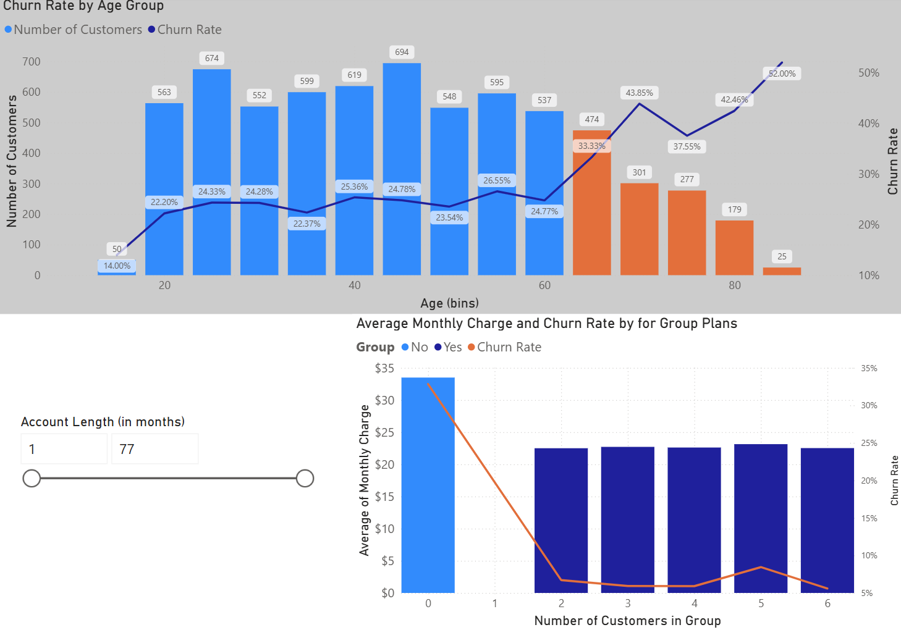

# reducing-customer-churn-with-data-driven-insights-powerbi
Power BI project analyzing customer churn patterns and business insights

# 1) Project Overview

This project analyzes customer churn data using Power BI to identify key factors influencing customer retention and business performance.

The goal is to help businesses understand why customers leave and provide actionable insights to reduce churn.

# 2) Dataset

Source: DataCamp Case Study

Includes:

• Customer demographics

• Subscription details

• Monthly charges

• Churn status

# 3) Tools & Skills Used

• Power BI

• Data Cleaning

• Data Modeling

• DAX (Data Analysis Expressions)

• Data Visualization

# 4) Key Insights

• Customers with higher monthly charges are more likely to churn

• Short-term contracts show higher churn rates

• Certain customer segments are more at risk

# 5) Dashboard Features

• Churn rate overview

• Customer segmentation

• Monthly revenue analysis

• Interactive filters for deeper analysis

# 6) Dashboard Preview

# 7) Business Recommendations

• Improve retention strategies for high-risk customers

• Offer incentives for long-term contracts

• Monitor high-charge customers more closely

# 8) Files Included

a) Power BI dashboard:

- initial_churn_project_file.pbix

- churn_PBI_Project_Jeremy Chaussy.pbix

b) Dataset:
   
- Datalabel - data.csv

c) Dashboard screenshots
   
- age_group.png

- insights.png

- overview.png

- payment_and_contract.png

- unlimited_plan.png
